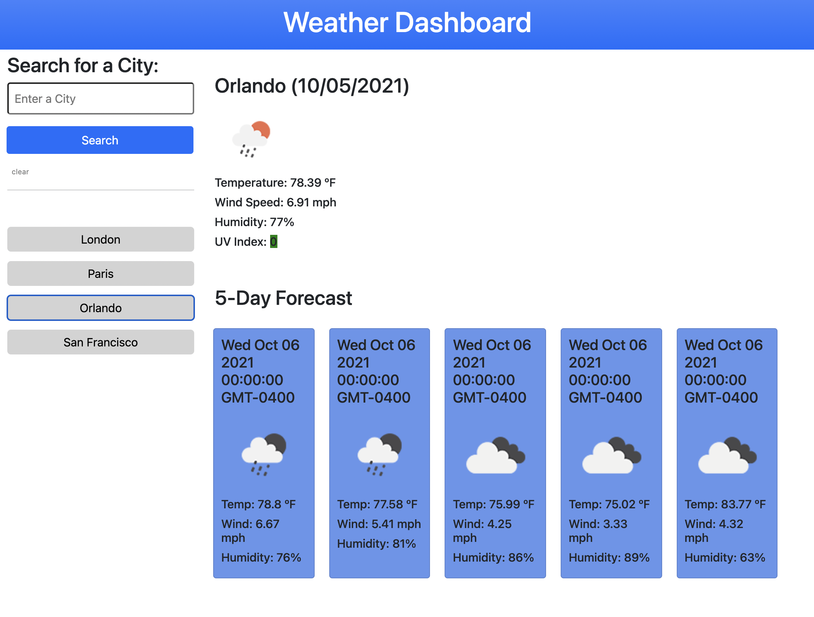

# Weather Dashboard

## Description
A dashboard for current and upcoming weather data for whichever city you choose.

## Usage
To view the live website, follow this link: [Weather Dashboard](https://luminescify.github.io/weather-dashboard/)

## Functionality
Users can enter their desired location and receive current and 5-day weather forecasts. Local storage retains their previous searches for later, and users can click on any past search to bring up current weather data.

All data is dynamic and updates accordingly.

## Screenshot
The following is a screenshot of the live page:

